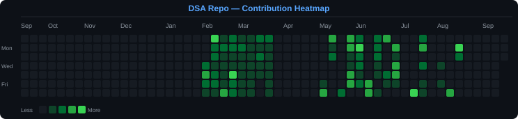

<div align="center">

# 🗂️ Data Structures & Algorithms — C++

<p align="center">
  
  &nbsp;
  
  &nbsp;
  
</p>

<!-- STATS_START -->
<p align="center">
  
  &nbsp;
  
  &nbsp;
  
</p>
<!-- STATS_END -->

<p align="center">
  <em>A structured, daily-updated collection of <strong>LeetCode</strong> and <strong>GeeksforGeeks</strong> solutions in <strong>C++</strong>,<br/>
  organized by topic and pattern — reflecting consistent practice and algorithmic growth.</em>
</p>

</div>

---

## 📁 Repository Structure

```
Data-Structures-And-Algorithms-CPP/
├── DP/                    → Dynamic Programming problems
├── General (daily problems)/  → Daily challenge solutions
├── LinkedList/            → Linked List problems
├── matrix/                → Matrix / 2D Array problems
├── pattern-wise/          → Pattern-based problem sets
├── queue/                 → Queue problems
├── stack/                 → Stack problems
└── strings/               → String manipulation problems
```

---

## 📈 Consistency Tracker

> Commit heatmap for **this repo only** — generated from actual git history. Every green square = a day you pushed solutions.

<br/>



---

## 🔗 Platforms

Problems are solved on these platforms and **manually committed** to this repo, organized by topic/pattern.

### 🟡 LeetCode

| | |
|:---|:---|
| 🔗 **Profile** | [leetcode.com/u/jaimin_123](https://leetcode.com/u/jaimin_123/) |
| 📂 **Organized by** | Topic / Pattern (manual, intentional structure) |

### 🟢 GeeksforGeeks

| | |
|:---|:---|
| 🔗 **Profile** | [geeksforgeeks.org/profile/jaiminvankar](https://www.geeksforgeeks.org/profile/jaiminvankar) |
| 📂 **Organized by** | Topic / Category (manual, intentional structure) |

---

## 🏆 LeetCode Stats

<div align="center">

[](https://leetcode.com/u/jaimin_123/)

</div>

---

## 🌿 GFG Stats

<div align="center">

[](https://www.geeksforgeeks.org/profile/jaiminvankar)

</div>

---

## 🛠️ Tech Stack

| Tool | Purpose |
|:---|:---|
| **C++** | Primary language for all solutions |
| **Markdown** | Documentation and problem notes |
| **VS Code** | Development environment |

---

<div align="center">

*Consistency is the key. Every commit counts. 🚀*

<br/>


</div>
